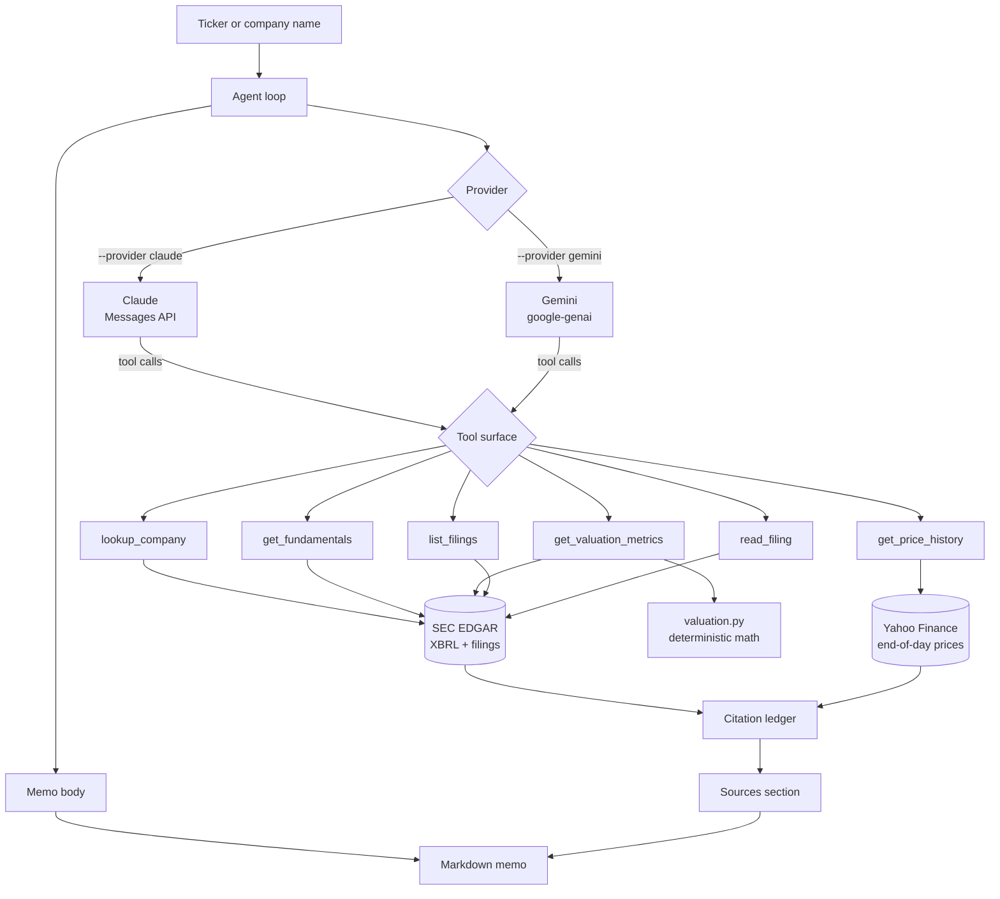

# Equity Research Agent

An AI agent that researches a public company the way an analyst would: pull the
filings, compute the numbers, read what management actually wrote, and produce a
memo where every figure traces back to a primary source.

Runs on **Claude** or **Gemini** — same tools, same memo, one flag.

[](https://github.com/aman-ace/equity-research-agent/actions/workflows/ci.yml)
[](https://www.python.org/downloads/)
[](LICENSE)
[](https://docs.claude.com/)
[](https://ai.google.dev/)

```bash
equity-research COST --out memos/costco.md                  # uses whichever key is set
equity-research COST --provider gemini --model gemini-2.5-pro
```

```markdown
# Equity Research Memo — COST

*Prepared 27 July 2026 · claude `claude-opus-5` · Effort: `high`*

## Summary
{one paragraph: what the company does, how the last reported year went, where
 the valuation sits}

## Business            ## Financial performance    ## Valuation
## Risks               ## What would change this view

## Sources
1. Costco Wholesale Corp, XBRL company facts (SEC EDGAR). Accessed 2026-07-27. <https://data.sec.gov/…>
2. SEC EDGAR filing history. Accessed 2026-07-27. <https://data.sec.gov/submissions/…>
3. Yahoo Finance end-of-day price history for COST. Accessed 2026-07-27. <https://query1.finance.yahoo.com/…>

## Disclaimer
…
```

Section shape only. Real figures appear only in a real run, and only from tool
results — see [`examples/sample-memo.md`](examples/sample-memo.md) for the full
rendered structure. This README deliberately contains no invented numbers about a
real company, which is the failure mode the project exists to prevent.

---

## Why this exists

Language models are fluent about companies and unreliable about their numbers.
A model asked for Costco's operating margin will produce a plausible figure with
no way to tell whether it read it or recalled it.

This agent removes that ambiguity by construction:

| Design decision | What it prevents |
| --- | --- |
| Every number comes from a tool result on SEC data | Recalled or invented figures |
| Ratios are computed in Python, not by the model | Arithmetic errors stated with confidence |
| A citation ledger records every URL fetched | A sources list the model wrote from memory |
| Untagged fields return `null`, never a proxy | Silent substitution of a different line item |
| Multiples are labelled trailing, with their price date | Trailing figures passed off as forward estimates |

The model still does what models are good at — deciding what to look at, reading
a risk-factor section, and judging what matters. It just doesn't get to make up
the inputs.

## How it works



Tools are declared once as provider-neutral `ToolSpec` objects — a name, a
description, a JSON Schema, and a Python callable. Each backend adapts them to
its own encoding, so adding a provider means writing one adapter, not touching
the research code.

### The tool surface

| Tool | Returns |
| --- | --- |
| `lookup_company` | Resolves a ticker or name to an SEC registrant and CIK |
| `get_fundamentals` | Annual income statement, balance sheet, and cash flow from XBRL |
| `get_price_history` | Last close, 52-week range, trailing returns, annualized volatility |
| `get_valuation_metrics` | Margins, returns, leverage, growth, and trailing multiples |
| `list_filings` | Recent 10-K / 10-Q / 8-K filings with direct document links |
| `read_filing` | A filing stripped to plain text, truncated to fit the context |

Six tools, each doing one thing. `get_valuation_metrics` exists so the model
never has to divide two numbers itself.

## Quickstart

Requires Python 3.10+ and an API key from **either** provider.

```bash
git clone https://github.com/aman-ace/equity-research-agent.git
cd equity-research-agent

pip install -e ".[claude]"     # Claude backend
# or
pip install -e ".[gemini]"     # Gemini backend
```

The data layer is the only hard dependency; the model SDK comes from the extra
you choose, so a Gemini user never installs the Anthropic package and vice versa.

```bash
# EDGAR asks that automated requests identify themselves.
export SEC_USER_AGENT="Your Name your@email.com"

export ANTHROPIC_API_KEY="sk-ant-..."     # for Claude
export GEMINI_API_KEY="..."               # for Gemini

equity-research COST
```

With no `--provider`, the agent picks whichever key is present (Claude wins if
both are set).

```bash
equity-research "Costco" --out memos/costco.md      # write to a file
equity-research NVDA --years 7                      # more history
equity-research JPM --effort xhigh                  # deeper reasoning (Claude)
equity-research AAPL -q "How concentrated is Services revenue?"
equity-research --list-models                       # Gemini models your key can use
```

### Web UI

```bash
equity-research --serve            # opens http://127.0.0.1:8000
```

A single local page: enter a ticker, watch each tool call as it fires, and read
the finished memo rendered with its table and clickable sources, with a button to
download the Markdown.

```bash
equity-research --serve --port 9000 --no-browser
```

The server is the standard library's `ThreadingHTTPServer`, so the UI adds no
dependencies — the project still installs with `httpx` plus one model SDK. A run
takes a minute or two, so progress streams over Server-Sent Events rather than
leaving the page blank; `research()` executes on a worker thread while the
request thread drains its event queue. It binds to localhost and holds no state,
which is all a single-user tool needs — it is not hardened for a shared host.

Or from Python:

```python
from equity_agent import AgentConfig, research

memo = research("COST", config=AgentConfig(provider="gemini"))
print(memo.to_markdown())
print(f"{len(memo.citations)} sources, {memo.output_tokens} output tokens")
```

### Choosing a provider

| | Claude | Gemini |
| --- | --- | --- |
| Install extra | `.[claude]` | `.[gemini]` |
| Key | `ANTHROPIC_API_KEY` | `GEMINI_API_KEY` (or `GOOGLE_API_KEY`) |
| Default model | `claude-opus-5` | `gemini-2.5-pro` |
| `--effort` | Applied | Ignored — Gemini's thinking controls are model-specific, so the model default is used. Tune with `--model`. |
| Cost | Paid per token | Free tier available |

Model identifiers change faster than this README does. If a default model name is
rejected, run `equity-research --list-models` to see what your key can actually
call, then pass `--model`.

## Data sources

| Source | Used for | Notes |
| --- | --- | --- |
| [SEC EDGAR XBRL company facts](https://www.sec.gov/edgar/sec-api-documentation) | Financial statement line items | As filed by the issuer; no vendor normalization |
| [SEC EDGAR submissions](https://www.sec.gov/edgar/sec-api-documentation) | Filing history and document URLs | Free, no key |
| [Yahoo Finance chart endpoint](https://finance.yahoo.com/) | End-of-day prices | Free, no key; not intraday |

Both are free and keyless, so a clone of this repo runs without signing up for a
data vendor. The trade-off is deliberate: fundamentals come from primary
documents, and prices are end-of-day rather than live.

### What it does not do

- **No forward estimates.** No consensus, no guidance model, no forecast. Every
  multiple is trailing and labelled as such.
- **No peer comparison** unless you ask for a second ticker; a peer multiple the
  agent has not retrieved is one it will not cite.
- **US registrants only.** EDGAR coverage means foreign issuers without a US
  listing are out of scope.
- **Concept coverage varies by filer.** XBRL tags differ across issuers; the
  extractor tries several concepts per field and reports `null` when none match
  rather than guessing.
- **Not investment advice.** See the disclaimer appended to every memo.

## Development

```bash
pip install -e ".[dev]"     # both backends plus pytest and ruff
pytest
ruff check .
ruff format --check .
```

Tests are hermetic — `httpx.MockTransport` for the data layer, scripted stub
clients for both provider loops. No API key, no network, no rate limits. CI runs
on Python 3.10–3.12.

```
src/equity_agent/
├── agent.py            # the prompt, run configuration, memo assembly
├── toolspec.py         # provider-neutral tool declaration
├── tools.py            # the six tools exposed to the model
├── providers/
│   ├── base.py         # the interface a backend implements
│   ├── claude.py       # Anthropic Messages API loop
│   └── gemini.py       # google-genai function-calling loop
├── sec.py              # EDGAR: ticker lookup, XBRL extraction, filing text
├── market.py           # end-of-day prices and derived statistics
├── valuation.py        # deterministic ratio math (pure functions)
├── sources.py          # HTTP with retries and the citation ledger
├── memo.py             # memo assembly and rendering
└── cli.py              # command-line entry point
```

### Adding a provider

Implement one method:

```python
class MyProvider:
    name = "my-provider"
    model = "some-model"

    def run(self, *, system, prompt, tools, max_tokens, max_turns) -> RunResult: ...
```

Adapt `ToolSpec.name`, `.description`, and `.input_schema` to your SDK's tool
format, call `ToolSpec.call(arguments)` when the model asks for one, and return
the final text. Register it in `providers/__init__.py`. Nothing in `sec.py`,
`market.py`, `valuation.py`, or `memo.py` changes.

## Roadmap

- [ ] Segment-level revenue extraction from XBRL dimensions
- [ ] Peer set comparison against a supplied ticker list
- [ ] Quarterly (10-Q) trend alongside the annual series
- [ ] Memo caching so re-runs on the same filings cost nothing
- [ ] Export to `.docx` for circulation

## License

MIT — see [LICENSE](LICENSE).

**Disclaimer:** This project is for research and educational purposes. Its output
is not investment advice, an offer, or a solicitation. Figures are as reported by
issuers and are not independently audited. Verify against the primary sources
before relying on anything it produces.
